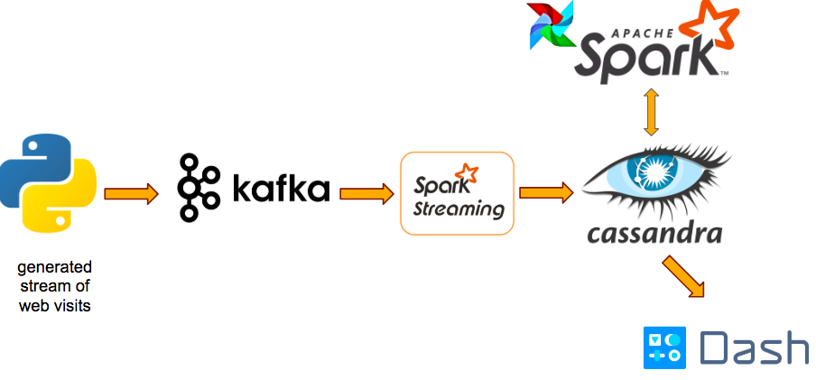

# OnTheSamePage
*Documentation is a work in progress*

My Insight Data Engineering project for the NY Summer 2018 session. "On the Same Page" is an application that uses a data pipeline to monitor website pages in real time.

# Motivation
In web development, it is important to understand how users interact with pages in their websites to compile analytics, monitor any abnormal-or even dangerous-changes in web traffic, and track pages that users are most engaged with. Moreover, page-by-page monitoring can help news and video websites understand the articles or videos that attract the most users, allow data scientists to analyze popular topics, and advertisers determine pages that make the most money.

# Pipeline

"On the Same Page" runs a pipeline on the AWS cloud, using the following cluster configurations:

* four m4.large EC2 instances for Kafka
* four m4.large EC2 instances for the Spark Streaming job and Cassandra 
* three m4.large EC2 instances for the Spark batch job
* one t2.micro EC2 instance to run the Dash front-end application

Using Kafka to ingest messages, Spark Streaming to calculate user counts in 5 second intervals along with Spark batch jobs to calculate average page counts every minute as a baseline, and Cassandra to store the processed data to be queried, the data is then rendered in Dash to show real-time updates to user visits every 5 seconds.

# Getting Started
To set up the application, you must have an AWS account set up to run it within the cloud. Clusters must be set up to match the configurations defined in the "Pipeline" section for Kafka, Spark and Cassandra. The guide used within the pegasus (ADD HYPERLINK TO THIS) documentation can be used to configure AWS onto your created clusters.

Once the clusters are up, install the following onto all m4.large clusters as per the pegasus documentation:
---
ssh
aws
environment
---

For the Kafka cluster, install and start:
---
zookeeper
kafka
---

For the Spark & Cassandra clusters, install and start:
---
hadoop
spark
cassandra
---

For the Spark batch cluster, install and start:
---
hadoop
start
---

## Kafka Setup
Use `peg ssh` on your Kafka cluster to SSH into the master node. Create the necessary "site_log" Kafka topic using the command:
---
create "site_log" topic command
---

Move the "kafka" folder from the repository folder into the home directory of the Kafka node you want to run the Kafka producer script from. Then, to run the producer script through `tmux`, run 
---
spawn_kafka_streams.sh IP_ADDRESS NUM_SPAWNS SESSION 
---
where IP_ADDRESS is the IP address of the desired Kafka broker, NUM_SPAWNS is the number of simulated producers, and SESSION is the session ID. To stop the Kafka stream through `tmux`, just run the command
---
tmux kill-session -t SESSION
---

## Cassandra & Spark Streaming Setup
Use `peg ssh` on your Spark & Cassandra cluster to SSH into the master node. Move the "spark" and "cassandra" folders from the repository folder into the home directory of the Spark node you want to run the Spark Streaming process from. 

### Cassandra
Run the Cassandra .cql file from the "cassandra" directory to set up the necessary keyspace and tables using:
---
cqlsh -f cassandra_schema.cql

### Spark Streaming
Within the "streaming_counts" folder, run these commands to build and assemble the Scala project:
---
sbt package
sbt assembly
---
Then, run the project by executing the script:
---
start_streaming_job.sh
---

## Spark Batch & Airflow Setup
Use `peg ssh` on your Spark batch cluster to SSH into the master node. Move the "spark" and "airflow" folders from the repository folder into the home directory of the Spark batch node you want to run the Spark batch process from. 

### Spark Batch
Within the "batch_averages" folder, just run the `sbt package` command to build the Scala project. To test the batch job for a single run without Airflow scheduling, run it by executing the script:
---
average_page.sh
---

### Airflow
Install Airflow by running the command
---
pip install airflow
---
Next, initialize the database that Airflow uses to store its metadata and start the webserver.
---
pip install airflow[hive]
airflow initdb
airflow webserver -p 8081
---
Edit the config file `~/airflow/airflow.cfg` so that `dags_folder=[path/to/airflow_spark_dag.py]`. Then, in your "airflow" directory, run the command to add your DAG to the list of Airflow DAGs
---
python airflow_spark_dag.py
---
You can check your list of DAGs using the `airflow list-dags` command. If your created DAG does not appear in the list, run the command `airflow resetdb` and then re-initialize the database and add the DAG again.
---
Finally, unpause the Spark DAG and run the scheduler to get the averages every minute:
---
airflow unpause sparkBatchMinute
airflow scheduler
---

# Data Challenges
