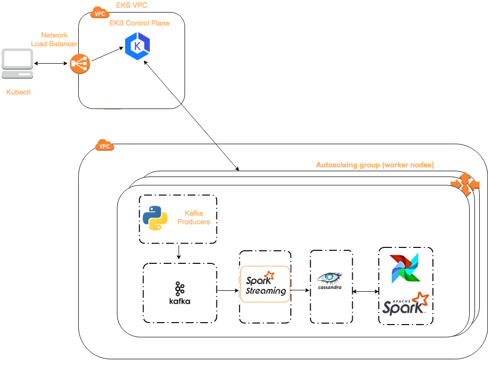

# Data Pipeline in K8S
My Insight DevOps Engineering project for the NY 2019A session. The pipeline I used for this project is from [agdsouza/OnTheSamePage](https://github.com/agdsouza/OnTheSamePage) that supports monitoring of website pages in real time.

A video demo of the pipeline operation in Kubernetes can be found [here](https://youtu.be/Mec7F5CQqa8).

# Motivation
While running containerized stateless applications in Kubernetes has been proved very effective, deploying stateful components like Kafka, Cassandra etc. is still in its early stages and Kubernetes ecosystem is evolving very fast to support it. This project should serve as a good starting point for anyone who wants to get some basic understanding on how things work within Kubernetes and the interaction between different components deployed.

# Pipeline in Kubernetes

The following is the configuration for the Kubernetes cluster provisioned on AWS:

* EKS Control Plane 
* Worker nodes with three m4.xlarge EC2 instances

The following are the objects deployed in Kubernetes.

* Confluent Kafka
* Cassandra
* Apache Spark Streaming
* Apache Spark Batch + Airflow
* Python application as Kafka producer

The weblog messages ingested from a Kafka producer get picked up from a Kafka topic by Spark Streaming to populate raw_data table in Cassandra database. Spark batch job which gets scheduled to run every minute via Airflow computes the averages from raw_data and populates page_averages table in Cassandra.

# Getting Started
See the [wiki](https://github.com/sontivr/k8s-on-the-same-page/wiki/Getting-Started) page for instructions on getting started.

